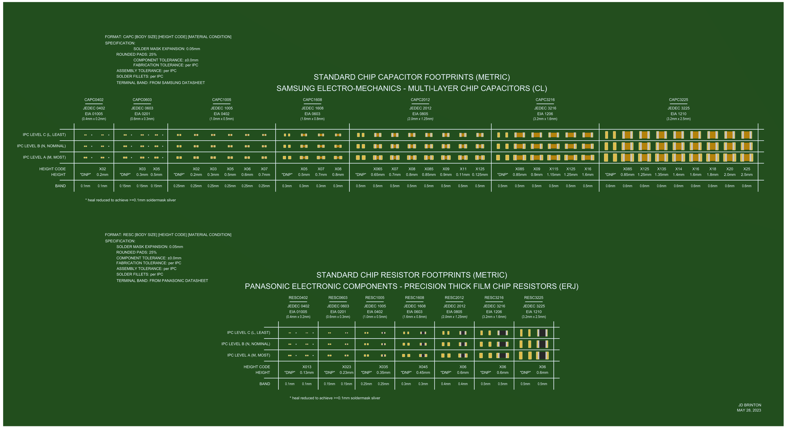
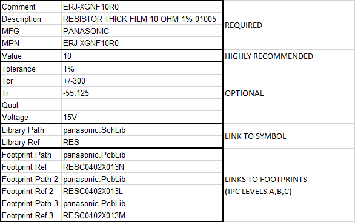

# Humanity's Last Footprint Library

Are you tired of messing around with passive footprints? Want to get an Altium footprint library that does it correctly? This library is for you!



## Limitations

This library is limited to chip resistors and chip capacitors between 01005 (metric 0402) and 1210 (metric 3225). To calculate 3D model and landing pad dimensions, certain dimensions are needed from the chip, such as terminal width, height, and tolerances. So it isn't possible to make a truly generic footprint library. No highly optimized footprint library can really be generic.

## The Philosophy

IPC-SM-782 was one of the original standards documents to define Printed Circuit Board (PCB) land patterns for Surface Mount Devices (SMD). Originally published in 1996, it was later superseded by IPC-7351 in 2005. IPC-7351 was then revised in 2007 and 2010. This library is based on the IPC-7351 2010 guidelines.

However, the guidelines do not fully define land pads. Rather, they specify three classes of PCB fabrication and assembly tolerances and corresponding solder fillets *given* component tolerances. These component tolerances must come from the designer.

So, what component tolerances do we use? The JEDEC standardization body defines a list of standardized two-terminal chips.

....

### On the Question of 3D Tolerances

When mechanical engineers are taking a 3D model of a printed circuit board for enclosure or heatsink design, they'll often ask if the component dimensions are nominal or max. If they're designing a compression thermal pad, they need to know the minimum and maximum component dimensions. Having 3D bodies that represent the maximum dimensions as provided by the manufacturer can be useful to ensure clearances to adjacent components are guaranteed, but this is not the only use case. Designing a thermal pad is an example where having maximum dimensions can lead to a lack of thermal contact. Therefore, this library uses the nominal component dimensions in its 3D models.

## The Library

Different organizations make different layer, drafting, solder mask, paste mask, courtyard, and 3D-body choices. This library intentionally uses a minimal footprint artwork set:

1. Pads
    a. Land dimensions calculated from IPC-7351B (2010) solder-joint goals for the selected density level.
    b. Paste mask expansion is rule-based and defined at the PCB document level.
    c. Solder mask expansion is manually set to 0.05 mm (1.97 mil).
    d. SMD pads use rounded-rectangle geometry with a 25% corner radius.
    e. Component body length, body width, and height tolerance inputs are set to ±0% unless otherwise stated.
    f. Terminal/band length assumptions are family-specific: RESC uses Panasonic ERJ-family dimensions; CAPC uses Samsung CL-family dimensions.

2. Component outline on Mechanical 15.
3. Component centroid/origin mark on Mechanical 15.
4. 3D model on Mechanical 1.

The IPC-calculated pad dimensions are used except for `CAPC0402*`, `CAPC0603*`, and `RESC0402*`, where the pads are adjusted to preserve at least 0.10 mm solder-mask web between adjacent pads.

Footprints are named using the IPC-7351B land-pattern naming convention for chip resistors and chip capacitors:

```text
RESC{LL}{WW}X{H}{D}
CAPC{LL}{WW}X{H}{D}
```

where:

- `RESC` / `CAPC`: IPC package-family prefix for chip resistors / chip capacitors.
- `LL`: nominal component body length in 0.1 mm units, encoded with one digit on each side of the decimal point.
- `WW`: nominal component body width in 0.1 mm units, encoded with one digit on each side of the decimal point.
- `H`: nominal component height in 0.01 mm units. The value is encoded by formatting the height with two decimal places, removing the decimal point, and removing leading zeros before the decimal point only. Therefore `0.05 mm -> X05`, `0.65 mm -> X65`, `1.00 mm -> X100`, and `2.50 mm -> X250`.
- `D`: IPC density-level suffix: `L` for least, `N` for nominal, or `M` for most.
## Structure

Every vendor `.xls` workbook in this repository follows the same column schema, captured canonically in [`resistor_template.xlsx`](resistor_template.xlsx). Columns are split into five groups; the first two groups carry the human-facing identity of the part, the third carries electrical parameters used for filtering / BOM, and the last two tell Altium where to fetch the schematic symbol and PCB footprints when the part is placed. Example values below show one row for `ERJ-XGNF10R0`:



Notes:

- `Comment` is the row's key field — it's what the `*.DbLib` binds as its `Single key lookup` database field (see [Regenerating the Databases](#regenerating-the-databases) for the gotcha that tripped us up here). Keeping `Comment = MPN` is the simplest convention and what every script in this repo does.
- `Description` follows the form `<CONSTRUCTION> <VALUE> <TOLERANCE> <CASE>` (e.g. `RESISTOR THICK FILM 10 OHM 1% 01005`) so it's human-scannable at BOM time without a schematic.
- The three `Footprint Path` / `Footprint Ref` pairs hold the three IPC-7351 density variants for the same physical part. This library follows IPC-7351B's **L**/**N**/**M** suffix convention (**L**east / **N**ominal / **M**ost), which is the same concept the older IPC-SM-782 "A/B/C" labels referred to. Which variant the PCB actually uses is a board-level choice made via Altium PCB rules, not encoded here.
- `Library Path` and `Footprint Path` are resolved by Altium relative to the `*.DbLib` file's location (put a `.\` prefix in front of a bare filename to force Altium into "relative path" resolution mode, otherwise it falls through to `LibrarySearchPath` lookup). Current vendor scripts write `.\house.SchLib` / `.\house.PcbLib` — the `panasonic.SchLib` / `panasonic.PcbLib` values shown in the template are legacy illustrative values from before the shared `house.*` libraries landed.
- Columns in **Required** and **Highly recommended** groups should never be blank for a row. **Optional** fields may be blank on a per-MPN basis when the datasheet doesn't quote the value (e.g. non-automotive parts legitimately have a blank `Qual`).


## Setup

The build has a single host-side prerequisite:

**Python 3.11+** — the per-vendor generator scripts, the `house-footprints` merge, the parametric STEP generator, and the `.PcbLib` writer are all Python. 3.11 is the floor because the merge reads `house/settings.toml` via the stdlib `tomllib`. The only third-party dependency pinned in [`requirements.txt`](requirements.txt) is `xlwt` (writes the database `.xls` files Altium's DbLib reads). Everything else — the per-vendor footprints JSONs, the merge, the STEP geometry engine, the MS-CFB v3 container writer, and the AltiumSharp v1.0.2-compatible record writer — is pure stdlib.

> Earlier versions of this repo used a small C# project (under `house/HouseLibGenerator/`, since deleted) that wrapped the [`OriginalCircuit.AltiumSharp`](https://www.nuget.org/packages/OriginalCircuit.AltiumSharp) NuGet package to emit the `.PcbLib`. That dependency, plus its transitive .NET 8 SDK requirement, has been replaced by the pure-Python writer in [`house/altium_pcblib/`](house/altium_pcblib). Output is byte-stable across runs (same MD5 every build) and structurally identical to what the C# tool produced (verified end-to-end against AltiumSharp's reader on a 168-footprint reference library).

### Python virtualenv

**Linux / macOS / WSL** — replace `python3.12` below with whatever ≥3.11 interpreter you have on `PATH` (`python3.11`, `python3.13`, …):

```bash
python3.12 -m venv .venv
. .venv/bin/activate
pip install -r requirements.txt
```

> On Debian/Ubuntu (WSL included) the `venv` module ships in a separate apt package per minor version. If `python3.X -m venv` errors with `No module named ensurepip`, install the matching package: `sudo apt install python3.12-venv` (or `python3.11-venv`, etc.).

**Windows (PowerShell or cmd)**

```bat
py -3.12 -m venv .venv
.venv\Scripts\activate
pip install -r requirements.txt
```

Once the venv is activated, plain `python` resolves to the venv's interpreter, so `python build.py` Just Works.

### One-shot

After the Python venv is activated:

```bash
python build.py
```

(Bare `python build.py` is the same as `python build.py all`.) If you'd rather not activate the venv, point at it explicitly: `.venv/bin/python build.py` on Linux/macOS/WSL, or `.venv\Scripts\python build.py` on Windows.

> **WSL note — `Permission denied` on `python build.py clean`**
>
> When the project lives on a Windows drive (e.g. `/mnt/d/...`) and any of the `build/output/*.xls` database workbooks or `build/output/house.PcbLib` are open on the Windows side (Excel on the workbooks, Altium on the .PcbLib), the `clean` step can't unlink them and aborts. Close the offending app and re-run.

## Output layout

Everything generated lives under a single `build/` directory (which is `.gitignore`d). The tree is split into two top-level subdirectories with mutually-exclusive purposes:

| Directory | Contents | Audience |
| --- | --- | --- |
| `build/output/` | `.xls` databases, matching `.DbLib` files, `house.PcbLib`, `house.SchLib`, `standards/HLCL-001.pdf` | **You.** This is what you point Altium at, ship to colleagues, or commit to a downstream library repo. |
| `build/intermediate/` | per-vendor footprints JSONs, the merged `house-footprints.json`, parametric `.step` 3D models, pdflatex aux/log/toc files | The build chain itself. Nothing user-facing reads these. Safe to ignore unless you're debugging the generator. |

Every Python generator writes its user-facing artifacts directly into `build/output/`; there is no copy or stage step, and **no parallel copy of any user-facing file lives in `build/intermediate/`**. So if a file shows up in `build/output/`, it's the deliverable; no need to wonder which directory the "real" copy is in.

The per-vendor `.DbLib` files use `LibrarySearchPath=.` (their own directory) for `house.SchLib` / `house.PcbLib` lookups, so a `build/output/` copied / committed elsewhere as a unit keeps resolving correctly.

## Building with `build.py`

The repo ships a single Python build orchestrator at [`build.py`](build.py). It runs every generator in-process (no `subprocess`, no `make`) so the same code drives the build from a host shell today and from [Pyodide](https://pyodide.org) in the browser tomorrow. It auto-discovers per-family generators by globbing every `vendors/*/*/_build.py` (and `house/*/_build.py`); a new family just needs to drop in its own `_build.py` stub.

- `python build.py` or `python build.py all` - build everything (vendor `.xls`s in `build/output/` + per-vendor footprint JSONs in `build/intermediate/footprints/` + merged JSON + 3D STEP models in `build/intermediate/step/` + `build/output/house.PcbLib` + `build/output/house.SchLib`)
- `python build.py panasonic-erj` - build `build/output/panasonic-erj.{xls,DbLib}` + matching `build/intermediate/footprints/panasonic-erj-footprints.json` (Panasonic ERJ thick-film, 01005-0805)
- `python build.py panasonic-era-a` - build `build/output/panasonic-era-a.{xls,DbLib}` + matching footprints JSON (ERA-A thin-film, 0201 only)
- `python build.py panasonic-era-v` - build `build/output/panasonic-era-v.{xls,DbLib}` + matching footprints JSON (ERA-V/K thin-film high-stability, 0402-0805)
- `python build.py panasonic-era-p` - build `build/output/panasonic-era-p.{xls,DbLib}` + matching footprints JSON (ERA-P 500V thin-film, 1206)
- `python build.py panasonic` - convenience aggregate that builds all four `panasonic-*` family targets above (auto-derived from any 2+ family targets that share a manufacturer prefix)
- `python build.py tdk-capacitors` - build `build/output/tdk-capacitors.{xls,DbLib}` + matching footprints JSON
- `python build.py samsung-capacitors` - build `build/output/samsung-capacitors.{xls,DbLib}` + matching footprints JSON
- `python build.py murata-gcm` - build `build/output/murata-gcm.{xls,DbLib}` (Murata GCM, automotive-qualified MLCC) + matching footprints JSON
- `python build.py murata-grm` - build `build/output/murata-grm.{xls,DbLib}` (Murata GRM, commercial / general-purpose MLCC) + matching footprints JSON
- `python build.py murata-ferrites` - run the Murata BLM-series ferrite-bead generator (`build/output/murata-ferrite.{xls,DbLib}`)
- `python build.py murata` - aggregate that builds all three `murata-*` family targets above
- `python build.py ohmite-kdv` - build `build/output/ohmite-kdv.{xls,DbLib}` (Ohmite KDV, metal-film current-sense resistors) + matching footprints JSON
- `python build.py house-footprints` - merge per-vendor footprints JSONs into `build/intermediate/footprints/house-footprints.json` (transitively builds every vendor target first)
- `python build.py house-step-models` - generate parametric 3D STEP models in `build/intermediate/step/*.step` via `house/stepgen/`
- `python build.py house-pcblib` - autogenerate `build/output/house.PcbLib` from the merged JSON + STEP models (calls into `house/altium_pcblib/`, the pure-Python writer)
- `python build.py house-schlib` - copy the hand-maintained `house.SchLib` into `build/output/`
- `python build.py standards` - typeset `docs/standards/HLCL-001.tex` into `build/output/standards/HLCL-001.pdf` via two `pdflatex` passes. Excluded from `all` because pdflatex is a heavy host-side dep most users don't have, and as a subprocess it can't run inside Pyodide. Override the engine via the `HLCL_PDFLATEX` env var.
- `python build.py clean` - remove the entire `build/` tree (both `intermediate/` and `output/`) plus any `__pycache__/` directories under `vendors/` and `house/`
- `python build.py --list` - print every registered target

> **Adding a vendor / family.** Each vendor folder under `vendors/<mfg>/<family>/` (and each `house/<component>/` subfolder) has its own `_build.py` stub that `build.py` picks up via wildcard glob. To add a new family: `mkdir vendors/<mfg>/<family>`, drop in your generator script + a 10-line `_build.py` that calls `register(...)`, then add the vendor key to `house/settings.toml`'s `house_footprints.priority`. No edits to `build.py` required. See any existing `vendors/*/*/_build.py` for the template.

# Regenerating the Databases

Each vendor family has a Python script under `vendors/<mfg>/<family>/` (e.g. `vendors/panasonic/erj/panasonic-erj.py`, `vendors/tdk/cga/tdk-capacitors.py`, `vendors/murata/gcm/murata-gcm.py`) that emits two artifacts per script:

1. `build/output/<vendor>.xls` — the database workbook the vendor's `*.DbLib` binds to (one row per MPN). Excel 97-2003 BIFF8 written via `xlwt`. User-facing.
2. `build/intermediate/footprints/<vendor>-footprints.json` — the per-vendor footprint specification: one entry per unique CAPC / RESC footprint × density variant (`L`, `N`, `M`) the database above references. Each entry carries body geometry (`L × W × H`, terminal length `T`), a `kind` field (C / R / I / FB), and a `drawingNote` source attribution (e.g. _"Dimensions from Panasonic ERJ-XGN (01005 thick film)"_). The schema is defined and validated in [`vendors/_common.py`](vendors/_common.py). Intermediate; consumed by the merge / STEP / .PcbLib steps.

Once every per-vendor script has run, `house/build_house_footprints.py` (wired into `python build.py all` via the `house-footprints` target, whose `@vendors` pseudo-dep transitively depends on every registered vendor target) merges every `build/intermediate/footprints/*-footprints.json` into a single `build/intermediate/footprints/house-footprints.json` — the canonical input for both the STEP 3D model generator and the .PcbLib autogenerator. When two vendor JSONs define a row with the same `name` (e.g. Samsung CL and TDK CGA both define `CAPC1005X50N`), the merge breaks ties using the priority list in [`house/settings.toml`](house/settings.toml) — the vendor that appears first wins. The merge logs every conflict it resolves on stderr.

> **Adding a new vendor.** Drop a script under `vendors/<mfg>/<family>/` that calls `_common.write_footprints_json` with the unique CAPC/RESC/INDC footprints it requires (the existing scripts are good templates), and a 10-line `_build.py` stub next to it that calls `build.register(...)`. `build.py` picks up every `vendors/*/*/_build.py` via wildcard glob, so no top-level edit is needed. Add the vendor key to `house/settings.toml`'s `house_footprints.priority` to control tie-break behaviour.

## Autogenerating 3D STEP models (`build/intermediate/step/*.step`)

`python build.py house-step-models` (also pulled in by `python build.py all`) runs [`house/build_step_models.py`](house/build_step_models.py) which delegates to the geometry engine in [`house/stepgen/`](house/stepgen). The IPC-7351B density variants (`L` / `N` / `M`) only change the pad geometry — the component body itself is identical — so the generator deduplicates by *footprint root* (FootprintName minus its trailing density letter) and emits **one STEP per unique chip body**:

```
build/intermediate/step/CAPC0402X20.step  ← shared by CAPC0402X20{L,N,M}
build/intermediate/step/RESC0402X13.step  ← shared by RESC0402X13{L,N,M}
...
```

The .pcblib autogenerator strips the same density suffix when looking up each footprint's STEP file, so all three density variants in `build/output/house.PcbLib` reference (and zlib-embed) the same STEP body. After `python build.py all`, no external STEP files are required for the .PcbLib to render in Altium — the STEP files in `build/intermediate/step/` are kept around solely so a human can pop one open in any STEP viewer to spot-check the geometry.

The generator is intentionally **pure-stdlib Python** — no CadQuery, no FreeCAD, no OpenCASCADE bindings — for two reasons:

1. The whole module can run unmodified in [Pyodide](https://pyodide.org/) so a future browser-based UI can let engineers drag dimensions around and watch the 3D model update live.
2. A clean checkout has no native-binary CAD dependencies to install: just CPython 3.11+ and the two pure-Python deps in [`requirements.txt`](requirements.txt).

Per-family layering today:

| Family | Pieces | Edges | Body colour | Terminal colour |
|---|---|---|---|---|
| CAPC | dielectric body + 2 terminals | filleted (`r=0.05 mm`) | MLCC tan `#B7860B` | Sn silver `#CCCCCC` |
| INDC, FB | ferrite body + 2 terminals | filleted (`r=0.05 mm`) | ferrite blue `#264D94` | Sn silver `#CCCCCC` |
| RESC | alumina substrate + passivation cover + 2 C-shaped terminals (3 sub-pieces each) | sharp | substrate `#9E9E9E` / passivation `#171717` | darker grey `#808080` |

CAPC and INDC bodies use a 26-face filleted-box B-rep (6 main planes + 12 cylindrical edge fillets + 8 spherical corner octants), matching the Altium IPC LP Wizard output style. The fillet radius is clamped to `min(L, W, H) / 4` per box so it never eats more than 1/4 of any dimension — on tiny CAPC0402X20 footprints (W=0.2 mm) the fillet shrinks gracefully to 0.05 mm and remains visible.

RESC stays sharp-edged (no fillets) and instead uses a layered geometry that mirrors a real chip resistor: each "C"-shaped terminal is built from three flush sub-boxes (end-cap + top wrap + bottom wrap) so the terminal wraps around the substrate; the alumina substrate sits between the two C-terminals raised off the floor by the metallisation thickness; the passivation cover fills the top sandwich slot, flush with the terminal tops.

## Autogenerating `build/output/house.PcbLib`

`python build.py house-pcblib` (also pulled in by `python build.py all`) runs [`house/build_pcblib.py`](house/build_pcblib.py), the driver script for the pure-Python writer in [`house/altium_pcblib/`](house/altium_pcblib). It turns the JSON sidecar plus the parametric STEP files into `build/output/house.PcbLib` directly — no Altium IPC Batch Generator round-trip, no manual per-footprint tweaks, no .NET dependency. The writer applies:

- **IPC-7351B Tables 3-5/3-6 pad math** — toe `J_T`, heel `J_H`, side `J_S`, and round-off granularity per density level (L/N/M); fab tolerance `F = 0.10 mm` and placement tolerance `P = 0.05 mm` per IPC-7351B §3.1.3. The component-tolerance term `C` is zero by repo policy (the JSON sidecar enforces `Lmin == Lmax` etc. before the writer ever runs). See [`house/altium_pcblib/ipc.py`](house/altium_pcblib/ipc.py).
- **HLCL-001 drawing standards** — rounded-rectangle pads with 25% corner radius on Top Layer; manual 0.05 mm solder mask expansion per pad; outline + centroid on Mechanical 15 with 0.1 mm line width; embedded parametric 3D model (zlib-compressed STEP) on Mechanical 1 at the nominal `L × W × H`; no silkscreen, no courtyard. See [`docs/standards/HLCL-001.tex`](docs/standards/HLCL-001.tex) and [`house/altium_pcblib/hlcl.py`](house/altium_pcblib/hlcl.py).
- **Minimum solder mask sliver enforcement** — HLCL-001 §11.2.5 requires ≥ 0.1 mm solder mask sliver between adjacent pad apertures. When IPC's calculated `G - 2E` falls below 0.1 mm, the writer overlays a single Top Solder region across both apertures (instead of shrinking copper) and prints a "mask-bridge" diagnostic to stderr so the deviation is auditable. The families that hit this in the current dataset are CAPC0402, CAPC0603, RESC0402, and RESC0603.

The writer is structured into clean layers:

| Module | Role |
|---|---|
| [`altium_pcblib/cfb.py`](house/altium_pcblib/cfb.py) | Pure-Python MS-CFB v3 container writer (sectors, FAT, mini-FAT, directory tree). |
| [`altium_pcblib/binary.py`](house/altium_pcblib/binary.py) | Length-prefixed binary block framing (mirrors AltiumSharp's `BinaryFormatWriter`). |
| [`altium_pcblib/encoding`](house/altium_pcblib/binary.py) / `parameters_to_string` | Windows-1252 encoding + `\|KEY=VAL\|...` parameter list emitter. |
| [`altium_pcblib/primitives.py`](house/altium_pcblib/primitives.py) | `Coord` (1/10000 mil), `CoordPoint`, `Layer` enum, OLE color packing. |
| [`altium_pcblib/records.py`](house/altium_pcblib/records.py) | Dataclasses for `PcbPad`, `PcbTrack`, `PcbRegion`, `PcbComponentBody`, `PcbComponent`, `PcbModel`, `PcbLibrary`. |
| [`altium_pcblib/writer.py`](house/altium_pcblib/writer.py) | Per-record binary serialisers; ties everything into the CFB container. |
| [`altium_pcblib/ipc.py`](house/altium_pcblib/ipc.py) | IPC-7351B chip-component land pattern math. |
| [`altium_pcblib/hlcl.py`](house/altium_pcblib/hlcl.py) | HLCL-001 drawing-standards constants. |
| [`altium_pcblib/footprint.py`](house/altium_pcblib/footprint.py) | High-level chip-footprint factory (combines the above). |

The writer's wire format target is **AltiumSharp v1.0.2-compatible**: the same record byte layout, parameter-list ordering, and field-default sentinels that the v1 NuGet writer produced. We replicate v1's specific quirks (e.g. `EMBED=T` instead of `EMBED=TRUE` in model metadata; `IDENTIFIER=67,104,...` codepoint encoding; `Coord.FromInt32(1)` sentinels for otherwise-zero fields) so the output round-trips through v1's reader cleanly. AltiumSharp's reader on a 168-footprint reference library yields **0 errors, 0 warnings, 0 DTO field diffs** vs. the older C#-emitted output, and 1180 of 1181 internal CFB streams are byte-identical (the lone exception is `Library/Data`, where we deliberately use a fixed sentinel `DATE`/`TIME` for reproducibility instead of the wall-clock).

To regenerate just the .PcbLib (after a vendor JSON change has already propagated):

```bash
python build.py house-pcblib
```

Or invoke the writer directly:

```bash
python house/build_pcblib.py \
    --input    build/intermediate/footprints/house-footprints.json \
    --output   build/output/house.PcbLib \
    --step-dir build/intermediate/step
```

> **Historical note — `xlwt`'s malformed `WRITEACCESS` record.**
>
> Older revisions of this repo required every freshly-generated `build/output/<vendor>.xls` to be opened (and closed — no save needed) in Microsoft Excel before Altium's DbLib OLE DB reader could load it. The symptom was that the DbLib would open but its tables would appear empty, or tables would load but placed components would fail to resolve their symbols/footprints even with the field mappings correct.
>
> Root cause: `xlwt-1.3` emits a malformed `WRITEACCESS` record (BIFF type `0x005C`). Per [MS-XLS] §2.4.351 the 112-byte payload is supposed to be an `XLUnicodeString` (`uint16 cch`, `uint8 fHighByte`, then chars, then space padding); `xlwt` skips the framing bytes entirely and packs the owner name as raw ASCII followed by space padding. Excel's reader silently repairs the record on open; the ACE/Jet OLE DB driver Altium uses does not, and silently fails to load the table.
>
> **Fix:** `vendors/_common.py` monkey-patches `xlwt.BIFFRecords.WriteAccessRecord` to emit a spec-compliant `XLUnicodeString` payload. Every vendor script imports `_common` before saving its workbook, so the patch is applied in one place and every generated `.xls` opens directly in Altium. No Excel round-trip required.

# Vendor Library Details

- Panasonic resistor family rationale and inclusion matrix: [`vendors/panasonic/README.md`](vendors/panasonic/README.md). Per-family script details:
  - ERJ thick-film: [`vendors/panasonic/erj/`](vendors/panasonic/erj)
  - ERA-A thin-film 0201: [`vendors/panasonic/era-a/`](vendors/panasonic/era-a)
  - ERA-V/K thin-film high-stability: [`vendors/panasonic/era-v/`](vendors/panasonic/era-v)
  - ERA-P 500V thin-film 1206: [`vendors/panasonic/era-p/`](vendors/panasonic/era-p)
- TDK CGA capacitor notes: [`vendors/tdk/README.md`](vendors/tdk/README.md) + [`vendors/tdk/cga/`](vendors/tdk/cga)
- Samsung CL capacitor notes: [`vendors/samsung/README.md`](vendors/samsung/README.md) + [`vendors/samsung/cl/`](vendors/samsung/cl)
- Murata library overview: [`vendors/murata/README.md`](vendors/murata/README.md). Per-family scripts:
  - GCM (automotive MLCC): [`vendors/murata/gcm/`](vendors/murata/gcm)
  - GRM (commercial MLCC): [`vendors/murata/grm/README.md`](vendors/murata/grm/README.md)
  - BLM (ferrite beads): [`vendors/murata/blm/`](vendors/murata/blm)
- Ohmite KDV (current-sense resistor) notes: [`vendors/ohmite/kdv/README.md`](vendors/ohmite/kdv/README.md)

# Database Standards

See `docs/standards`

# Additional References

## Imperial to Metric Footprint Size Conversion

| Imperial Inch (EIA) | Metric (JEITA) <- used by this library |
|----------|-------------------------------|
| 01005    | 0402                          |
| 0201     | 0603                          |
| 0402     | 1005                          |
| 0603     | 1608                          |
| 0805     | 2012                          |
| 1206     | 3216                          |
