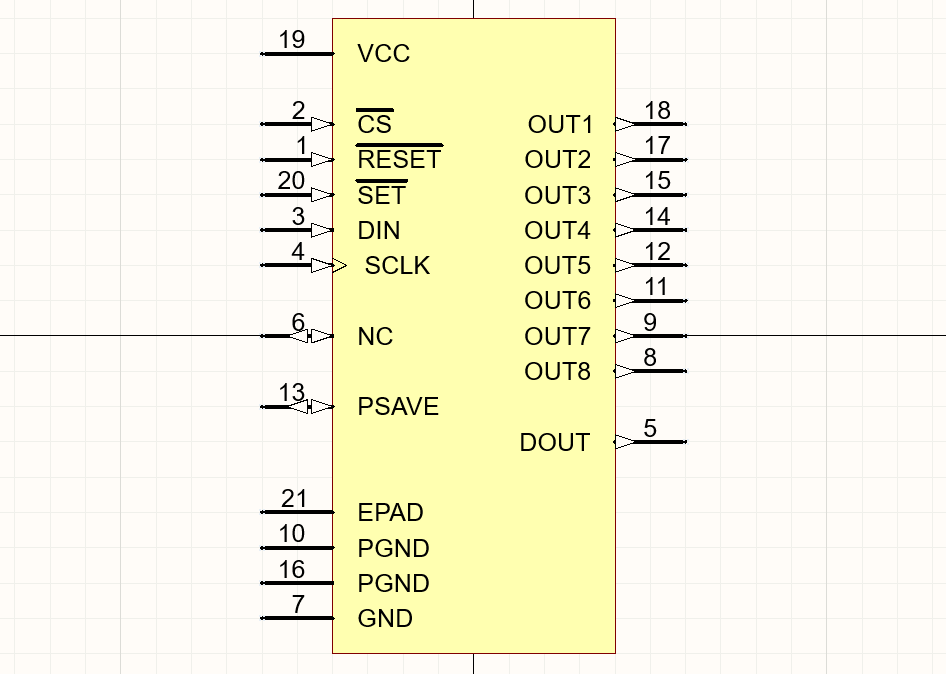
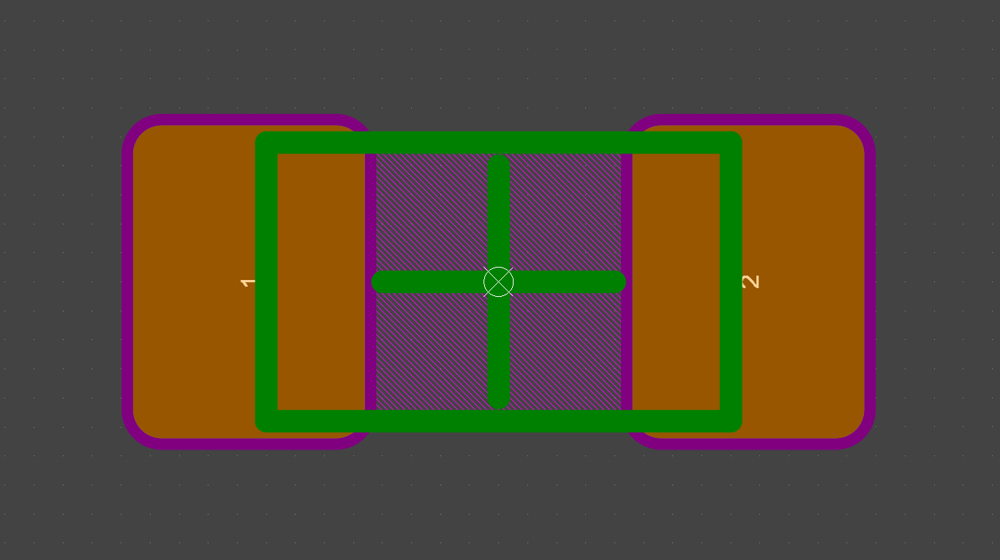

# Humanity's Last Component Library — EEE Component Standards

**HLCL-001** &mdash; Rev 1 &mdash; JD Brinton

---

## 1. Scope

This document defines naming, parameter, and description conventions for all EEE components in the Humanity's Last Component Library (HLCL) Altium component library. All new components shall conform to these standards.

## 2. General Rules

1. Descriptions: ALL CAPS. No trailing period.
2. Parameters stored as fields: Mixed case permitted (e.g. `10nF`, `+/-15%`).
3. SI prefixes: `p`, `n`, `u`, `m`, `k`, `M`. Never use μ; use `u`.
4. Units: `OHM` (descriptions), `V`, `A`, `W`, `Hz`, `F`, `H`.
5. Tolerance: Absolute uses unit suffix (`+/-0.25pF`). Percentage uses `%` (`5%`). Never use ±.
6. Temperature range: hyphen-colon format, e.g. `-55:125`.
7. Voltage: include `V` suffix, e.g. `25V`, `6.3V`.
8. No Unicode. ASCII only in all database fields.

## 3. Altium Workspace Library Revision IDs

Revision IDs in the Altium workspace library follow fixed patterns. The three-digit type code `xxx` identifies the component family. The complete allocation is listed with reference designator prefixes in Section 4.

### 3.1 Components

```
CMP-xxx-yyy-000000
```

| Field    | Definition                                                                                                                                                              |
| -------- | ----------------------------------------------------------------------------------------------------------------------------------------------------------------------- |
| `xxx`    | Component type (three digits; allocation in Section 4).                                                                                                                 |
| `yyy`    | Import series. Incremented each time a manufacturer or part series is imported so revision IDs do not collide with earlier imports of other series under the same type. |
| `000000` | Six-digit numeric suffix (unique per item within the `xxx`/`yyy` scope).                                                                                                |

### 3.2 Component Templates

```
CMPT-xxx
```

`xxx` is the component type code (same as for components).

### 3.3 Symbols

```
SYM-xxx-000000
```

`xxx` is the component type code. The final six digits are a numeric suffix as for components.

### 3.4 Footprints

```
PCC-xxx-000000
```

`xxx` is the component type code. The final six digits are a numeric suffix as for components.

## 4. Reference Designator Prefixes

| Prefix | Type code (`xxx`) | Component Type                                   |
| ------ | ----------------- | ------------------------------------------------ |
| R      | `000`             | Resistor                                         |
| C      | `001`             | Capacitor                                        |
| U      | `002`             | Integrated Circuit                               |
| D      | `003`             | Diode                                            |
| J      | `004`             | Connector                                        |
| Q      | `005`             | Transistor                                       |
| S      | `006`             | Switch                                           |
| Y      | `007`             | Crystal Resonator (does not include oscillators) |
| I      | `008`             | Inductor                                         |
| FB     | `009`             | Ferrite Bead                                     |
| M      | `010`             | Mechanical (e.g. mounting holes, spacers)        |

## 5. Schematic Symbols

One generic symbol per designator type. Symbol name equals the designator prefix or a functional variant.

| Symbol          | Usage                |
| --------------- | -------------------- |
| `CAP`           | All capacitors (C)   |
| `RES`           | All resistors (R)    |
| `IND`           | Inductors (I)        |
| `FERRITE`       | Ferrite beads (FB)   |
| `LED`           | LEDs (D)             |
| `DIODE`         | All other diodes (D) |
| `NMOS` / `PMOS` | MOSFETs (Q)          |
| `NPN` / `PNP`   | BJTs (Q)             |
| `SW`            | Switches (S)         |
| `XTAL`          | Crystals (Y)         |

U and J: one symbol per unique part (pin-specific).

## 6. Footprint Naming

All footprints follow IPC-7351B naming.

### 6.1 Two-Terminal Passives (C, R, I, FB)

```
{TYPE}{LLWW}X{HH}{D}
```

| Field  | Definition                                                                                 |
| ------ | ------------------------------------------------------------------------------------------ |
| `TYPE` | `CAPC` (capacitor chip), `RESC` (resistor chip), or `INDC` (inductor or ferrite bead chip) |
| `LLWW` | Body length and width in metric, each 2 digits × 0.1 mm                                    |
| `HH`   | Max component height in 0.01 mm units, trailing zeros dropped                              |
| `D`    | Density: `N` (nominal), `L` (least), `M` (most)                                            |

Examples: `RESC2012X06N`, `CAPC1005X05L`, `CAPC3225X25M`, `INDC1608X24N`.

### 6.2 Semiconductors, Connectors, Crystals, Switches (U, D, J, Q, S, Y)

Use the manufacturer package name or IPC-7351B land pattern name. Include pin count where applicable.

Examples: `SOT-23-3`, `QFN-48_7X7`, `HC49`, `USB-C-16`.

## 7. Description Format

Descriptions are a single line, ALL CAPS, space-delimited, with fields ordered as defined per component type.

### 7.1 Capacitors (C)

```
CAPACITOR CERAMIC {VALUE} {TOLERANCE} {VOLTAGE} {DIELECTRIC} {EIA_SIZE}
```

Example: `CAPACITOR CERAMIC 100NF 10% 16V X7R 0402`

Capacitance values in descriptions are ALL CAPS:

| Range           | Format                 |
| --------------- | ---------------------- |
| < 1 nF          | `PF`: `100PF`, `4.7PF` |
| 1 nF ≤ C < 1 µF | `NF`: `10NF`, `470NF`  |
| ≥ 1 µF          | `UF`: `1UF`, `100UF`   |

### 7.2 Resistors (R)

```
RESISTOR THICK FILM {VALUE} OHM {TOLERANCE} {EIA_SIZE}
```

Example: `RESISTOR THICK FILM 10K OHM 1% 0402`

For jumpers:

```
RESISTOR JUMPER 0 OHM {EIA_SIZE}
```

Resistance values in descriptions use condensed ALL CAPS notation:

| Range           | Format                          |
| --------------- | ------------------------------- |
| < 1 kΩ          | Plain number: `100`, `4.7`      |
| 1 kΩ ≤ R < 1 MΩ | `K` suffix: `1K`, `47K`, `4.7K` |
| ≥ 1 MΩ          | `M` suffix: `1M`, `2.2M`        |

### 7.3 Inductors (I)

```
INDUCTOR {CONSTRUCTION} {VALUE} {TOLERANCE} {DCR} {EIA_SIZE}
```

Example: `INDUCTOR MULTILAYER 4.7UH 20% 0.1 OHM 0402`

Inductance values in descriptions use the unit suffix, ALL CAPS: `NH`, `UH`, or `MH` (e.g. `100NH`, `4.7UH`, `10MH`).

### 7.4 Ferrite Beads (FB)

```
FERRITE BEAD {IMPEDANCE} {RATED_CURRENT} {EIA_SIZE}
```

`IMPEDANCE` is the typical impedance at 100 MHz, numeric with the `OHM` unit (e.g. `120 OHM`, `1K OHM`).

Example: `FERRITE BEAD 60 OHM 1A 0402`

### 7.5 Integrated Circuits (U)

```
IC {FUNCTION} {KEY_SPEC} {PACKAGE}
```

Example: `IC LDO REGULATOR 3.3V 500MA SOT-23-5`

### 7.6 Diodes (D)

```
DIODE {TYPE} {VOLTAGE} {CURRENT} {PACKAGE}
```

Type keywords: `SCHOTTKY`, `ZENER`, `TVS`, `LED`, `RECTIFIER`, `ESD`.

Example: `DIODE SCHOTTKY 40V 1A SOD-123`

### 7.7 Connectors (J)

```
CONNECTOR {TYPE} {PIN_COUNT}P {PITCH} {ORIENTATION}
```

Example: `CONNECTOR HEADER 10P 2.54MM VERTICAL`

### 7.8 Transistors (Q)

```
{TYPE} {POLARITY} {VOLTAGE} {CURRENT} {PACKAGE}
```

Type keywords: `MOSFET`, `BJT`, `JFET`.

Example: `MOSFET N-CH 30V 5.8A SOT-23`

### 7.9 Switches (S)

```
SWITCH {TYPE} {CONFIGURATION} {RATING} {PACKAGE}
```

Example: `SWITCH TACTILE SPST 50MA 12V SMD`

### 7.10 Crystals (Y)

```
CRYSTAL {FREQUENCY} {TOLERANCE} {CL} {PACKAGE}
```

Example: `CRYSTAL 16MHZ +/-20PPM 12PF HC49`

### 7.11 Mechanical (M)

```
{CATEGORY} {DIMENSIONS} {ATTRIBUTES} {PACKAGE}
```

CATEGORY and detail tokens are ALL CAPS. Type keywords:

`MOUNTING HOLE`, `SPACER`, `STANDOFF`, `FIDUCIAL`, `HARDWARE` (e.g. screws, standoffs, clips—use specific attributes).

Examples: `MOUNTING HOLE 2.1MM PTH`, `MECHANICAL MOUNTING HOLE 2.1MM NPTH`

## 8. Database Fields

### 8.1 Common Fields (All Types)

Present in every component database table.

| Column             | Key? | Content                                          |
| ------------------ | ---- | ------------------------------------------------ |
| `Comment`          | PK   | Full MPN. Unique key.                            |
| `Description`      |      | Per Section 7 format.                            |
| `MFG`              |      | Manufacturer name, ALL CAPS.                     |
| `MPN`              |      | Same as Comment.                                 |
| `Package`          |      | Imperial (inch) standard package name, ALL CAPS. |
| `Library Path`     |      | SchLib filename.                                 |
| `Library Ref`      |      | Symbol name (e.g. `CAP`, `RES`).                 |
| `Footprint Path`   |      | PcbLib filename.                                 |
| `Footprint Ref`    |      | Footprint name, Nominal density.                 |
| `Footprint Path 2` |      | PcbLib filename (same).                          |
| `Footprint Ref 2`  |      | Footprint name, Least density.                   |
| `Footprint Path 3` |      | PcbLib filename (same).                          |
| `Footprint Ref 3`  |      | Footprint name, Most density.                    |
| `Qual`             |      | Qualification (e.g. `AEC-Q200`, blank if none).  |

### 8.2 Capacitors (C)

| Column      | Content                                                           |
| ----------- | ----------------------------------------------------------------- |
| `Value`     | Capacitance: `{number}{prefix}F` (e.g. `100pF`, `4.7nF`, `10uF`). |
| `Tolerance` | e.g. `5%`, `+/-0.25pF`.                                           |
| `Voltage`   | Rated DC voltage (e.g. `25V`).                                    |
| `Tcr`       | Temperature characteristic (e.g. `+/-15%`, `+/-30`).              |
| `Tr`        | Operating temperature range (e.g. `-55:125`).                     |

### 8.3 Resistors (R)

| Column      | Content                                                                            |
| ----------- | ---------------------------------------------------------------------------------- |
| `Value`     | Resistance: `{number}{prefix}`, no "OHM" (e.g. `100`, `4.7k`, `1M`). Jumpers: `0`. |
| `Tolerance` | e.g. `1%`, `0.1%`.                                                                 |
| `Voltage`   | Limiting element voltage (e.g. `50V`).                                             |
| `Tcr`       | Temperature coefficient (e.g. `+/-100`). Units: ppm/K implicit.                    |
| `Tr`        | Operating temperature range (e.g. `-55:155`).                                      |

### 8.4 Inductors (I)

| Column      | Content                                                          |
| ----------- | ---------------------------------------------------------------- |
| `Value`     | Inductance: `{number}{prefix}H` (e.g. `100nH`, `4.7uH`, `10mH`). |
| `Tolerance` | e.g. `5%`, `20%`.                                                |
| `DCR`       | DC resistance (e.g. `0.1OHM`, `2.1mOHM`).                        |
| `Current`   | Rated current (RMS) or `Isat` as applicable (e.g. `1.5A`).       |
| `Tr`        | Operating temperature range (e.g. `-40:85`).                     |

### 8.5 Ferrite Beads (FB)

| Column    | Content                                                                                                                                        |
| --------- | ---------------------------------------------------------------------------------------------------------------------------------------------- |
| `Value`   | Impedance at 100 MHz, numeric with `OHM` (e.g. `60OHM`, `1KOHM`) unless another reference frequency is documented, then state it in the field. |
| `Current` | Rated current (RMS) (e.g. `1A`, `2A`).                                                                                                         |
| `DCR`     | DC resistance (e.g. `0.1OHM`).                                                                                                                 |
| `Tr`      | Operating temperature range (e.g. `-40:85`).                                                                                                   |

### 8.6 Integrated Circuits (U)

| Column | Content                                      |
| ------ | -------------------------------------------- |
| `Tr`   | Operating temperature range (e.g. `-40:85`). |

### 8.7 Diodes (D)

| Column    | Content                                            |
| --------- | -------------------------------------------------- |
| `Vr`      | Reverse voltage or breakdown voltage (e.g. `40V`). |
| `Vf`      | Forward voltage drop (e.g. `0.45V`).               |
| `Current` | Forward current rating (e.g. `1A`).                |
| `Tr`      | Operating temperature range (e.g. `-55:150`).      |

### 8.8 Connectors (J)

| Column    | Content                                           |
| --------- | ------------------------------------------------- |
| `Current` | Current rating per pin if applicable (e.g. `1A`). |
| `Voltage` | Rated voltage if applicable.                      |

### 8.9 Transistors (Q)

| Column    | Content                                               |
| --------- | ----------------------------------------------------- |
| `Voltage` | V<sub>DS</sub> or V<sub>CE</sub> rating (e.g. `30V`). |
| `Current` | I<sub>D</sub> or I<sub>C</sub> rating (e.g. `5.8A`).  |

### 8.10 Switches (S)

| Column    | Content                      |
| --------- | ---------------------------- |
| `Voltage` | Rated voltage (e.g. `12V`).  |
| `Current` | Rated current (e.g. `50mA`). |

### 8.11 Crystals (Y)

| Column      | Content                                          |
| ----------- | ------------------------------------------------ |
| `Value`     | Frequency with unit (e.g. `16MHz`, `32.768kHz`). |
| `Tolerance` | Frequency tolerance (e.g. `+/-20ppm`).           |
| `CL`        | Load capacitance (e.g. `12pF`).                  |
| `ESR`       | Equivalent series resistance (e.g. `40OHM`).     |
| `Tr`        | Operating temperature range (e.g. `-40:85`).     |

### 8.12 Mechanical (M)

| Column | Content |
| ------ | ------- |
| none   | none    |

## 9. Footprint Density Assignment

Three IPC-7351B density levels are stored per component.

| Slot            | Suffix | IPC Density Level        |
| --------------- | ------ | ------------------------ |
| Footprint Ref   | `N`    | Nominal (default)        |
| Footprint Ref 2 | `L`    | Least (tightest spacing) |
| Footprint Ref 3 | `M`    | Most (largest pads)      |

Semiconductors, connectors, switches, and crystals: populate Footprint Ref only. Leave slots 2 and 3 blank unless IPC density variants exist.

## 10. Schematic Symbol Drawing Standards

Use Altium default schematic editor settings. The following are called out explicitly to prevent deviation.

1. Grid: 100 mil snap, 100 mil visible.
2. Pin length: 200 mil default. May deviate to improve readability.
3. Pin font: **Arial 8pt**.
4. Line width: default (1px/small).
5. Filled body for passives. Unfilled (outline only) for ICs.
6. Designator visible, Value visible. Both use default font.
7. No color overrides. Use Altium default pin/body/text colors.
8. Pins shall snap to grid. All pin endpoints must land on 10 mil grid.
9. Pin numbers: always visible on all pins.
10. Set pin Electrical Type (passive, input, output, power, etc.) when well defined in the component datasheet.
11. Hidden pins are prohibited.
12. Component symbol shall be centered on the origin of the symbol editor (as close as grid permits).



## 11. PCB Footprint Drawing Standards

Do not populate the footprint Description field. All authoritative component descriptions are stored in the component database templates and shall not be duplicated in footprints.

### 11.1 Default Units

The PcbLib's default display unit shall be millimetres. All dimensions in this section, in vendor data, and in the IPC-7351B math used by the autogenerator are in millimetres unless explicitly noted otherwise.

### 11.2 Layer Usage

| Layer         | Content                                                 |
| ------------- | ------------------------------------------------------- |
| Top Layer     | Copper pads only.                                       |
| Top Solder    | Solder mask openings (manual expansion, see below).     |
| Top Paste     | Paste mask openings (rule-based, defined at PCB level). |
| Mechanical 1  | 3D body model.                                          |
| Mechanical 15 | Component centroid (cross-hair) and component outline.  |

Layers explicitly **not used** in footprints:

| Layer                    | Rationale                                                                                                 |
| ------------------------ | --------------------------------------------------------------------------------------------------------- |
| Top Overlay (silkscreen) | No component outline on silkscreen. Silkscreen designators are added during layout, not in the footprint. |
| Courtyard (Mech 13/etc.) | Not used. Board-level clearance rules handle spacing.                                                     |

### 11.3 Pads

1. Shape: Rounded rectangle, @@PAD_CORNER_RADIUS_PERCENT@@% corner radius (per IPC-7351B).
2. Pad dimensions: per IPC-7351B calculator using manufacturer dimensions.
3. Solder mask expansion: manual, set to @@SOLDER_MASK_EXPANSION_MM@@ mm (@@SOLDER_MASK_EXPANSION_MIL@@ mil) per pad.
4. Paste mask expansion: not set per pad; use board-level rule.
5. Minimum solder mask sliver between adjacent pads: @@MIN_SOLDER_MASK_SLIVER_MM@@ mm. If IPC-calculated pads violate this, add solder mask to combine apertures.
6. Thermal pad (exposed pad): include if specified by manufacturer. Paste mask subdivided per manufacturer recommendation.

### 11.4 3D Model (Mechanical 1)

1. Two-terminal chip components (CAPC, RESC, INDC, FB) shall use the parametric STEP generator under `house/stepgen/` (pure-Python, no external CAD dependencies). Because the IPC-7351B density variants (L / N / M) only change the pad geometry — not the component body — the generator deduplicates by footprint root (FootprintName minus its trailing density letter) and emits one STEP file per unique body into `build/intermediate/step/<root>.step`, e.g. `build/intermediate/step/CAPC0402X20.step` is shared by `CAPC0402X20{L,N,M}`. The build pipeline embeds (zlib-compressed) the same STEP into all three density variants of each root in `build/output/house.PcbLib` so the library is standalone.
2. Other components: use a manufacturer STEP file or, as a last resort, a simple extruded box matching L × W × H nominal.
3. Model shall use nominal component dimensions from the manufacturer datasheet.
4. Model origin shall align with footprint origin (component centroid).
5. Model Z-offset: @@COMPONENT_BODY_STANDOFF_MM@@ mm above pad surface.
6. Body colour conventions for autogenerated chip models:
   - CAPC — MLCC tan / cream over silver (Sn) terminals. Body and terminals have rounded edges (cylindrical fillet _r_ = @@DEFAULT_FILLET_RADIUS_MM@@ mm, clamped to min(L,W,H)/4).
   - INDC, FB — ferrite blue body over silver terminals. Same rounded-edge geometry as CAPC.
   - RESC — mid-grey alumina substrate, near-black passivation cover on top, slightly darker grey end-cap terminals. Sharp edges (no fillets). Each terminal is a "C" shape wrapping around the substrate (vertical end face + top strip + bottom strip), so the substrate is supported only by the bottom wraps and the passivation cover sits flush with the terminals' top wraps.

### 11.5 Component Outline and Centroid (Mechanical 15)

1. Line width: @@OUTLINE_LINE_WIDTH_MM@@ mm.
2. Component outline: closed rectangle matching the 2D projection of the 3D body (nominal L × W).
3. Centroid: cross-hair at component origin. Each arm shall be no longer than the corresponding half-extent of the component outline (so the cross never escapes the body rectangle), and shall be capped at @@MAX_CROSSHAIR_HALF_ARM_MM@@ mm per arm so the total cross length is at most @@MAX_CROSSHAIR_FULL_LENGTH_MM@@ mm regardless of body size.

### 11.6 Pin 1 Marking

Required on all oriented parts (ICs, diodes, transistors, polarized capacitors, connectors with keying).
Not required on non-polarized two-terminal passives (standard capacitors, resistors, crystals).

1. Layer: Top Overlay.
2. Content: single period character "`.`" (dot).
3. Font: TrueType Arial, text height 2 mm.
4. Placement: adjacent to pin 1 pad, outside the component outline.
5. The marker is a free text object (not locked to pad) so it may be repositioned during layout.

### 11.7 Footprint Origin

1. Origin placed at the geometric centroid of the pad pattern.
2. For symmetric packages: center of the body.
3. For connectors: pin 1 or the mechanical datum specified by the manufacturer.


