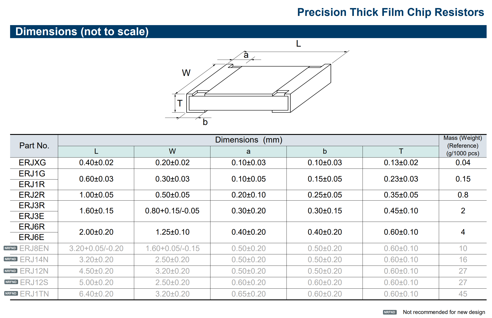

# Panasonic Library Notes

This folder is a per-family aggregator for the Panasonic chip-resistor
library. The legacy single `panasonic-resistors.py` was split into
four per-family subfolders (each with its own script, `_build.py`
registry stub, and `reference/` datasheet folder) so each family can
be built / iterated on independently.

| Family | Folder | Build target | xls | Notes |
| --- | --- | --- | --- | --- |
| **ERJ** (general-purpose thick-film + 0R jumpers) | [`erj/`](erj) | `python build.py panasonic-erj` | `build/output/panasonic-erj.xls` | 01005, 0201, 0402, 0603, 0805 sizes |
| **ERA-A** (precision thin-film 0201) | [`era-a/`](era-a) | `python build.py panasonic-era-a` | `build/output/panasonic-era-a.xls` | 0201 only — larger ERA-A sizes are superseded by ERA-V/K |
| **ERA-V / ERA-K** (high-stability thin-film) | [`era-v/`](era-v) | `python build.py panasonic-era-v` | `build/output/panasonic-era-v.xls` | 0402 / 0603 / 0805; V = standard range, K = high-resistance extension |
| **ERA-P** (high-voltage thin-film 1206) | [`era-p/`](era-p) | `python build.py panasonic-era-p` | `build/output/panasonic-era-p.xls` | 1206 only, 500 V limiting; we don't carry ERA-V/K at 1206 |

There's also an auto-derived `python build.py panasonic` aggregate
that builds all four family targets in one go.

## Shared code

- [`_panasonic_common.py`](_panasonic_common.py) — module imported by
  every per-family script, holding:
  - `HEADERS` (canonical workbook column order),
  - `RESC_BODIES` (the seven distinct chip body geometries any of
    the families reference, keyed by IPC-7351B footprint root),
  - the resistance-value lists (`e24_e96_combined_*`, `era_*`),
  - row builders (`make_res_range` / `make_res_jumper` for thick
    film, `make_era_range` for thin film) and the part-number
    formatters (`format_number`, `format_number_era`,
    `format_resistance`),
  - and `build_footprint_rows`, which expands a list of footprint
    roots into the L / N / M density rows the per-vendor footprints
    JSON wants.
- `reference/panasonic_fixed_resistors.pdf` and
  `reference/panasonic_precision_thick_film_chip_resistors.png` —
  cross-family overview material; per-family datasheets live under
  each subfolder's `reference/`.

## Family selection rationale

Panasonic groups [chip resistor series](https://industrial.panasonic.com/ww/products/resistors/chip-resistors) by application (high temperature, high precision, current sensing, high power, anti-sulfurated, general purpose, networks/arrays). The table below lists every chip-resistor family called out in their "Types of chip resistors" selector (April 2026), using the same family keys (wildcards `*` denote size/grade suffixes in part numbers).

For Panasonic's full fixed-resistor portfolio overview, see [`reference/panasonic_fixed_resistors.pdf`](reference/panasonic_fixed_resistors.pdf). Per-family datasheets are linked where available.

Reference image (Panasonic ERJ thick-film chip resistor family):

| Family (Panasonic) | Brief description | In Library |
| --- | --- | --- |
| **ERJH** | High-temperature / high-voltage thin-film chip resistors | |
| **[ERA\*P](era-p/reference/panasonic_era-p.pdf)** | Thin-film high-voltage 1206 line (500 V limiting voltage), otherwise matches ERA\*V/K | Yes - 1206 only (`ERA-8PEB`); see [`era-p/`](era-p) |
| **[ERA\*V / ERA\*K](era-v/reference/panasonic_era-v.pdf)** | Thin-film high precision / high stability (V = standard range, K = high-resistance extension) | Yes - 0402 / 0603 / 0805 only; see [`era-v/`](era-v); for 1206 see ERA\*P |
| **[ERA\*A](era-a/reference/panasonic_era-a.pdf)** | Thick-film high-precision chip resistors (A series) | Yes - 0201 only (`ERA-1AEB`); see [`era-a/`](era-a). 0402-1206 sizes are superseded by ERA\*V/K |
| **ERJPB** | Thick-film super high precision | No - redundant with ERA\*V / ERA\*K at the sizes we carry |
| **ERJPC** | Thick-film super high precision (newer ERJPC line) | |
| **ERJ\*B / ERJBW / ERJLW** | Current sensing: wide-terminal low-resistance thick-film types | |
| **ERJA / ERJB** | Current sensing: metal-plate (shunt) types | |
| **ERJD** | Current sensing: anti-surge metal-plate / specialized surge-rated types | |
| **ERJMB / ERJMS** | Current sensing: metal-plate for high current / anti-pulse applications | |
| **ERJP** | Small size / high power thick-film chip resistors | |
| **ERJT** | Small size / high power thick-film chip resistors (precision grades) | |
| **ERJS / ERJU** | Anti-sulfurated thick-film chip resistors | |
| **ERJU-R** | Anti-sulfurated wide-terminal types | |
| **ERJUP** | Anti-sulfurated thick-film precision | |
| **ERJC1** | Anti-sulfurated large-format / high-power special cases | |
| **[ERJ](erj/reference/panasonic_erj.pdf)** | General-purpose thick-film chip resistors | Yes - see [`erj/`](erj) |
| **EXB** (8, 15 element) | Resistor network (isolated / bussed) | |
| **EXB** (2, 4, 8 element) | Resistor array | |
| **EXBU** (2, 4, 8 element) | Anti-sulfurated resistor arrays | |
